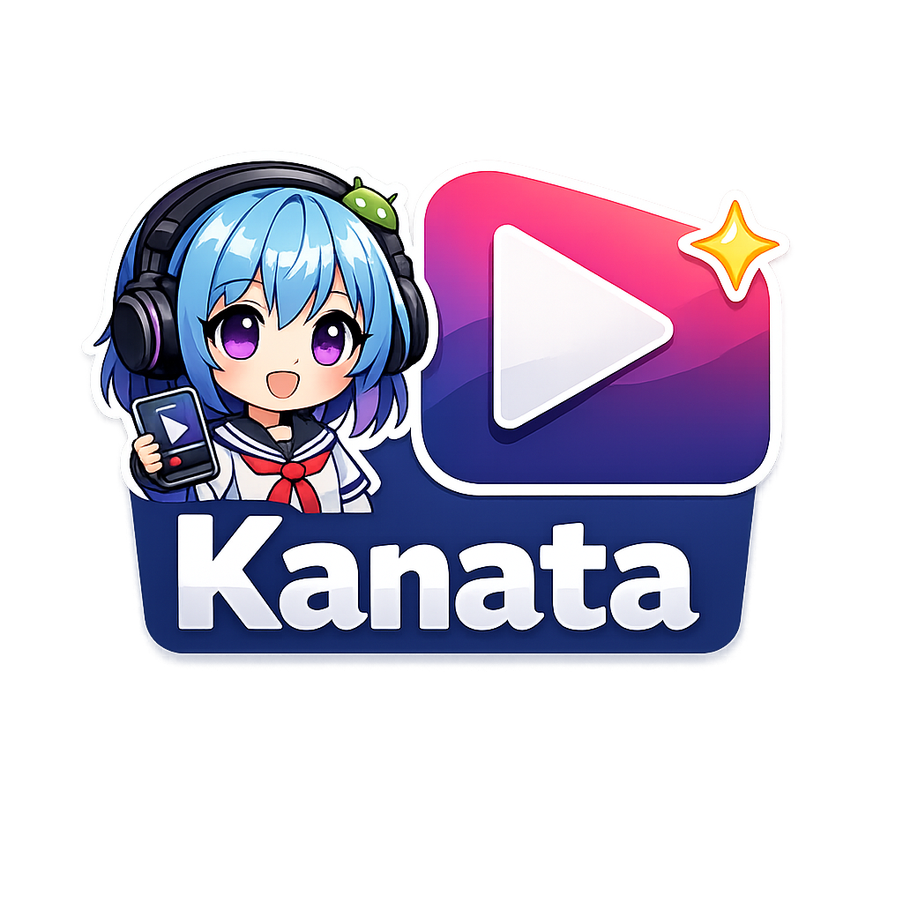

# Kanata

<p align="center">
  
</p>

An Android app for browsing anime information and streaming episodes from third-party sources.

-brightgreen)


[](CONTRIBUTING.md)

---

## Features

- **Anime catalogue** — browsable grid powered by the [Anime News Network](https://www.animenewsnetwork.com/encyclopedia/) encyclopedia API
- **Detail screen** — title, score, genres, synopsis, episode count, cover image
- **Favourites** — persist liked anime locally with Room
- **External search** — automatically finds the anime on YummyAnime and Aniwave after you open it
- **Available streams** — clickable source chips (YummyAnime / Aniwave) appear when found
- **Episode list** — browse all episodes from the selected source
- **Video player** — built-in HLS player via Media3 / ExoPlayer, auto-locks to landscape

---

## Architecture

```
app/
├── core/
│   ├── di/             # Koin modules (Repository, UseCase, ViewModel)
│   └── network/        # OkHttp + Retrofit setup
├── data/
│   ├── local/          # Room DB (favourites)
│   ├── remote/         # Retrofit API interfaces + DTO
│   └── repository/     # Repository implementations + web scraping (Jsoup)
├── domain/
│   ├── model/          # Pure Kotlin models
│   ├── repository/     # Repository interfaces
│   └── usecase/        # Single-responsibility use cases
├── features/
│   ├── details/        # Anime detail screen
│   ├── episodes/       # Episode list screen
│   ├── favorites/      # Favourites screen
│   ├── main/           # Home screen (anime grid)
│   ├── player/         # ExoPlayer screen
│   └── ...
└── navigation/         # Navigation3 back-stack + routes
```

**Pattern:** MVVM + Clean Architecture + UDF (Unidirectional Data Flow)  
Each feature has its own `State` / `Event` model pair. ViewModels expose `StateFlow<State>` and `Channel<Event>` for one-shot navigation/UI effects.

---

## Tech Stack

| Layer | Library |
|---|---|
| UI | Jetpack Compose, Material 3 |
| Navigation | [Navigation3](https://developer.android.com/jetpack/androidx/releases/navigation3) 1.0.0-alpha04 |
| DI | [Koin](https://insert-koin.io/) 4.0 |
| Networking | Retrofit 2 + OkHttp 4 |
| Web scraping | [Jsoup](https://jsoup.org/) |
| Image loading | [Coil](https://coil-kt.github.io/coil/) 2 |
| Video player | [Media3 / ExoPlayer](https://developer.android.com/media/media3) 1.5.1 |
| Local storage | Room 2.6, DataStore Preferences |
| GraphQL | Apollo 4 (AniList) |
| Serialization | Kotlin Serialization |

---

## Data Sources

| Source | Purpose |
|---|---|
| [Anime News Network Encyclopedia](https://www.animenewsnetwork.com/encyclopedia/) | Anime list & metadata (XML API) |
| [YummyAnime](https://yummyanime.tv) | Russian-dubbed episode streams |
| [Aniwave](https://aniwave.dk) | English-subbed episode streams |

> **Note:** Streaming is achieved via HTML scraping of publicly accessible pages.  
> No credentials or private APIs are used.

---

## Requirements

- Android **9.0 (API 28)** or higher
- Android Studio **Hedgehog** or newer (AGP 8.x)
- JDK 11

---

## Getting Started

1. Clone the repo:
   ```bash
   git clone https://github.com/green-rou/Kanata.git
   ```

2. Open in Android Studio and let Gradle sync.

3. Run on a device or emulator (API 28+).

> No API keys required — all data sources are publicly accessible.

---

## Project Status

Active development. Core features (browse, details, favourites, stream search, episode list, player) are functional.

Planned:
- Download episodes for offline viewing
- Search within the app catalogue
- More streaming sources

---

## Contributing

Pull requests are welcome. Please read [CONTRIBUTING.md](CONTRIBUTING.md) first.

---

## License

[MIT](LICENSE) © 2026 Kanata Contributors
