# Kanata — Screenshots

## Home

<table>
<tr>
<td align="center"><b>Catalogue</b></td>
<td align="center"><b>Filters</b></td>
</tr>
<tr>
<td></td>
<td>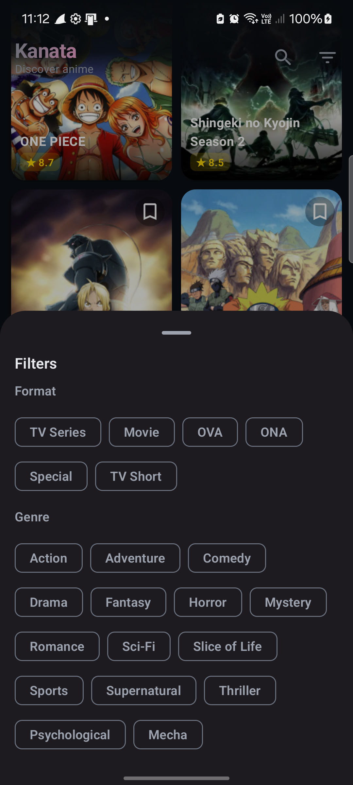</td>
</tr>
</table>

## Anime Detail

<table>
<tr>
<td align="center"><b>Detail</b></td>
<td align="center"><b>Detail (with downloads)</b></td>
</tr>
<tr>
<td>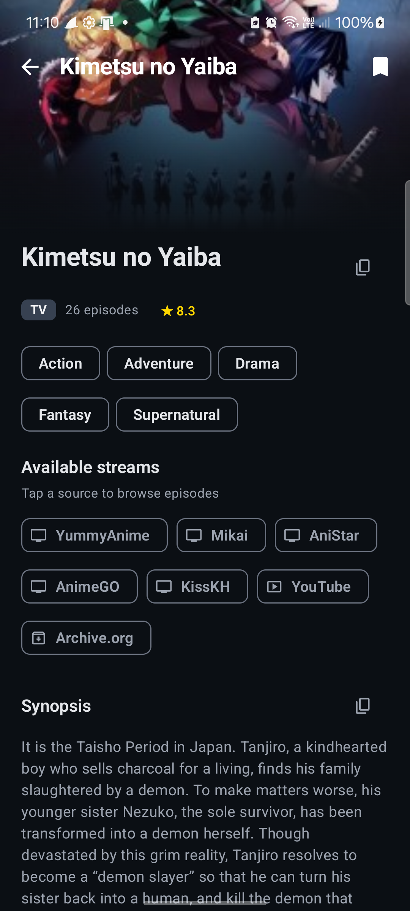</td>
<td>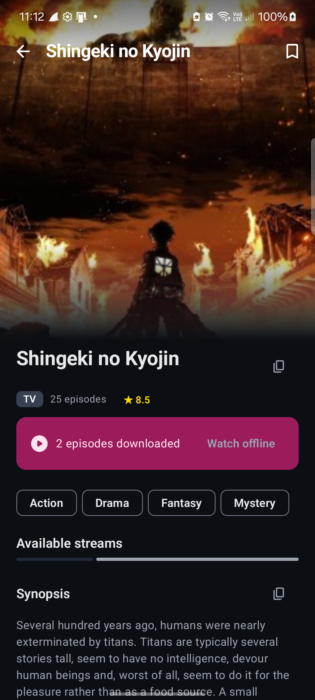</td>
</tr>
</table>

## Episodes & Player

<table>
<tr>
<td align="center"><b>Episode list</b></td>
<td align="center"><b>Video player</b></td>
</tr>
<tr>
<td>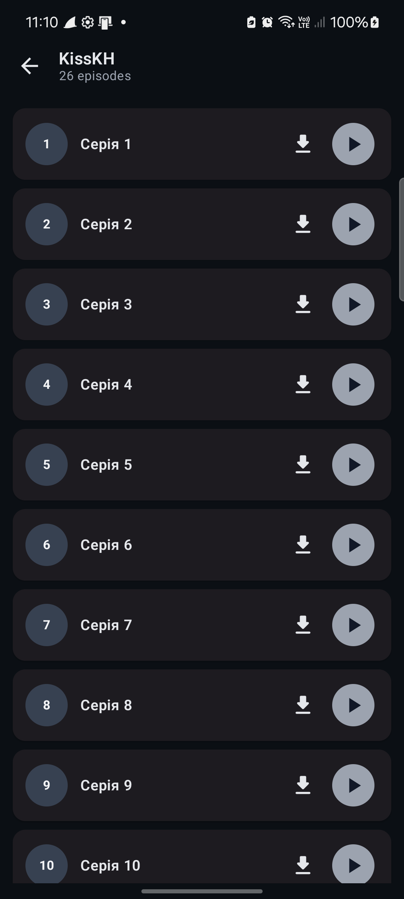</td>
<td>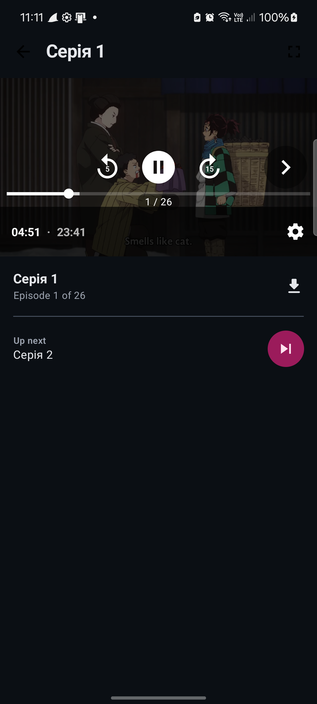</td>
</tr>
</table>

## Favourites

<table>
<tr>
<td align="center"><b>Favourites</b></td>
</tr>
<tr>
<td>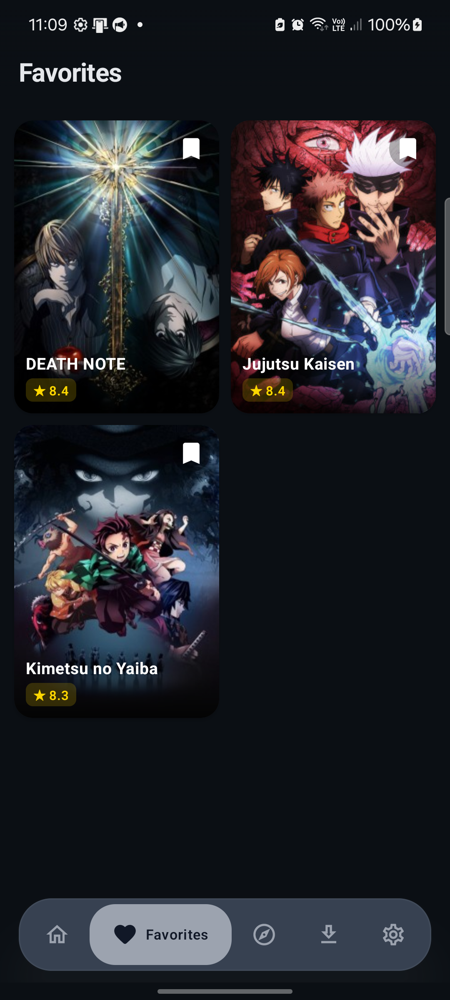</td>
</tr>
</table>

## Discover

<table>
<tr>
<td align="center"><b>By Mood</b></td>
<td align="center"><b>Random</b></td>
<td align="center"><b>Wallpaper</b></td>
</tr>
<tr>
<td>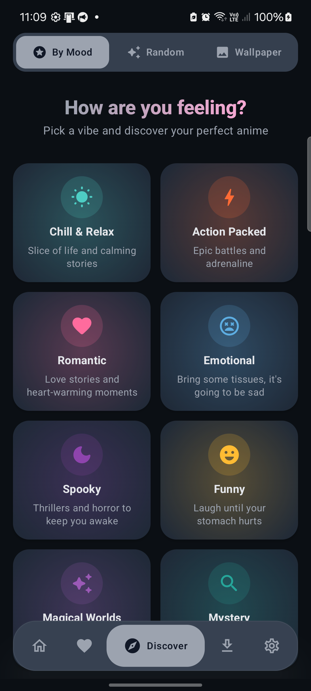</td>
<td>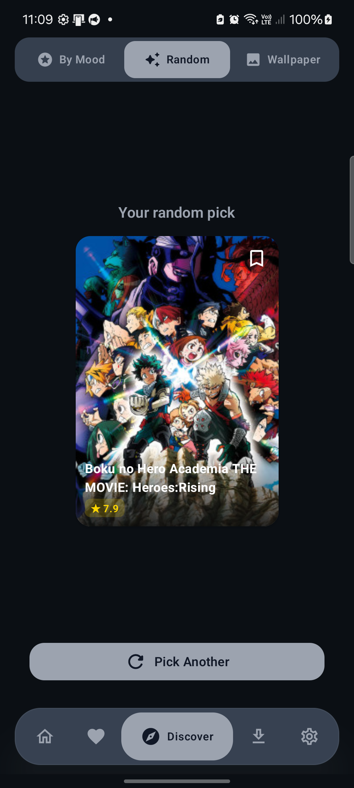</td>
<td>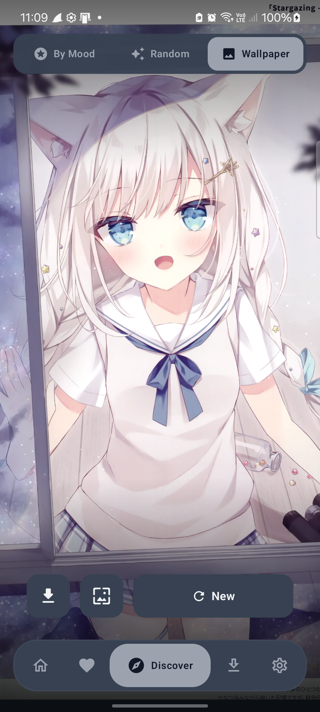</td>
</tr>
</table>

## Downloads

<table>
<tr>
<td align="center"><b>Queue</b></td>
<td align="center"><b>Completed</b></td>
</tr>
<tr>
<td>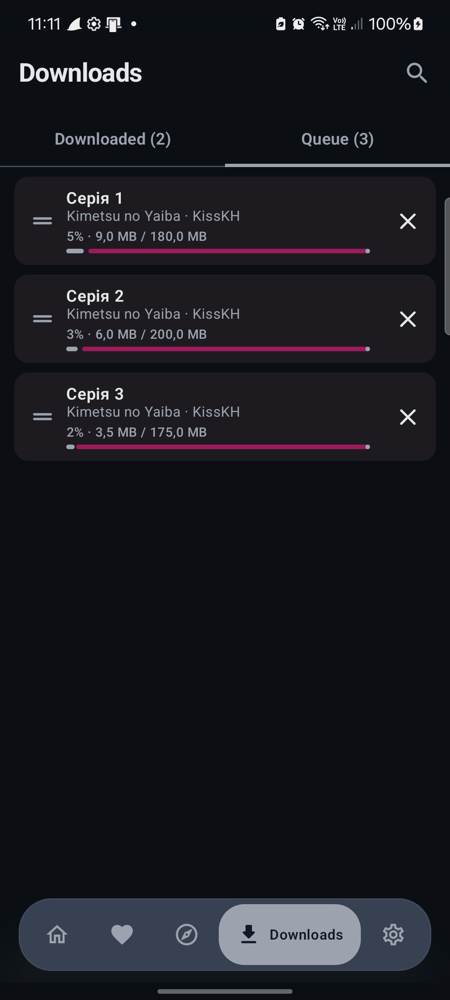</td>
<td>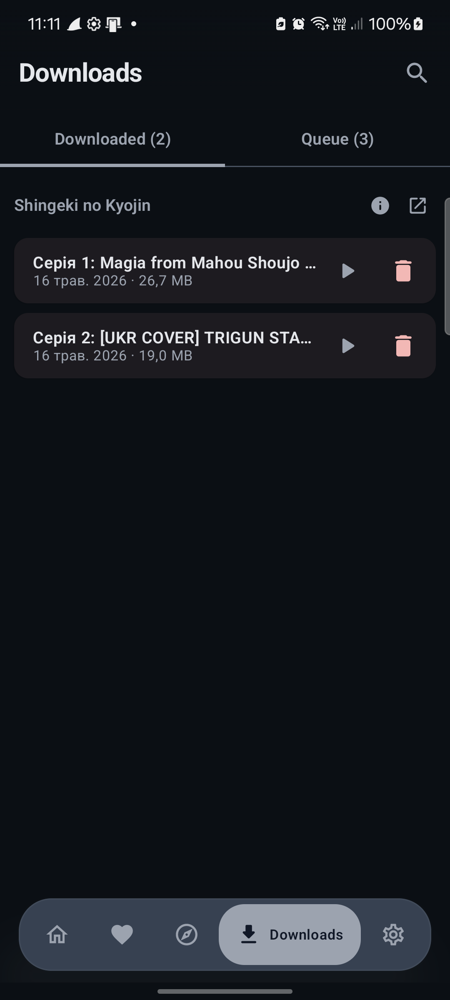</td>
</tr>
</table>

## Settings

<table>
<tr>
<td align="center"><b>General</b></td>
<td align="center"><b>Sources</b></td>
</tr>
<tr>
<td>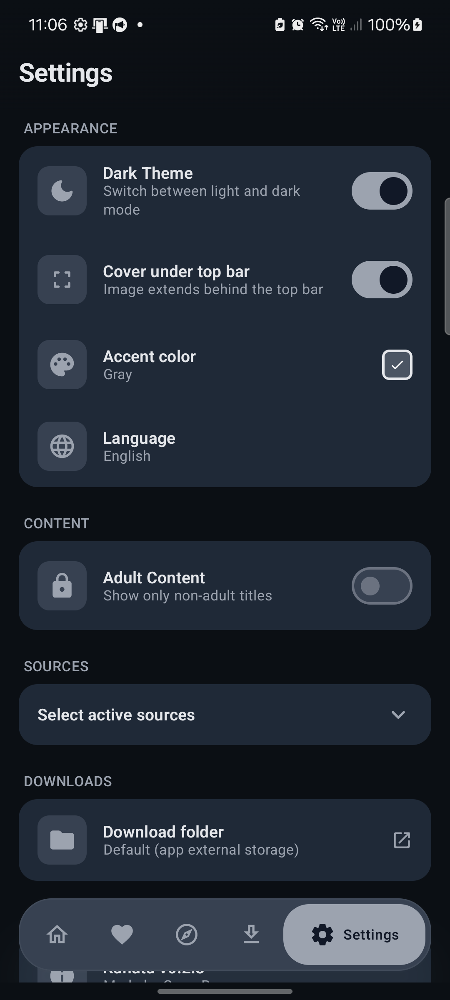</td>
<td>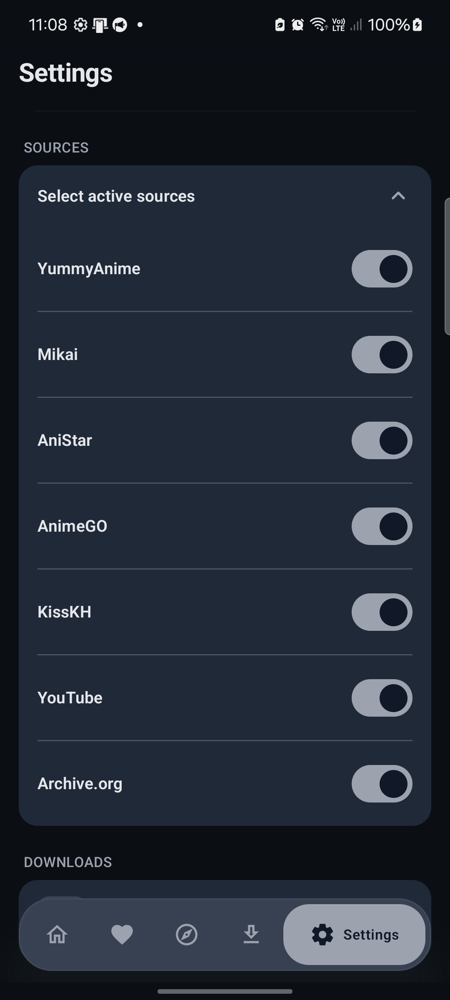</td>
</tr>
</table>
